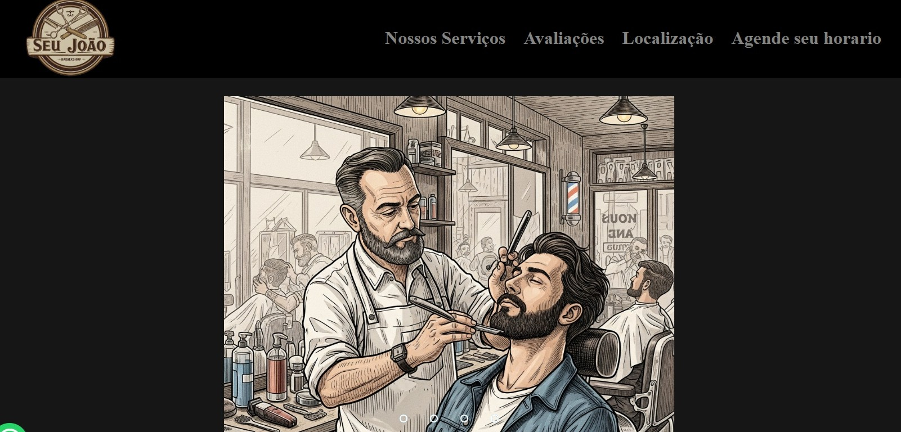

# Barbearia Landing Page

Uma landing page simples e responsiva para uma barbearia, desenvolvida com HTML, CSS e JavaScript.

## 📸 ScreenShot



## 🚀 Tecnologias Utilizadas

- HTML5
- CSS3
- JavaScript

## 📦 Como Executar

1. Clone o repositório:

   ```bash
   git clone https://github.com/dkrausz/barbearia-landing-page.git
   ```

2. Navegue até o diretório do projeto:

   ```bash
   cd barbearia-landing-page
   ```

3. Abra o arquivo `index.html` no seu navegador preferido.

## 📄 Licença

Este projeto está sob a licença MIT. Consulte o arquivo [LICENSE](LICENSE) para mais detalhes.

## 🙋‍♂️ Autor

- [@dkrausz](https://github.com/dkrausz)
